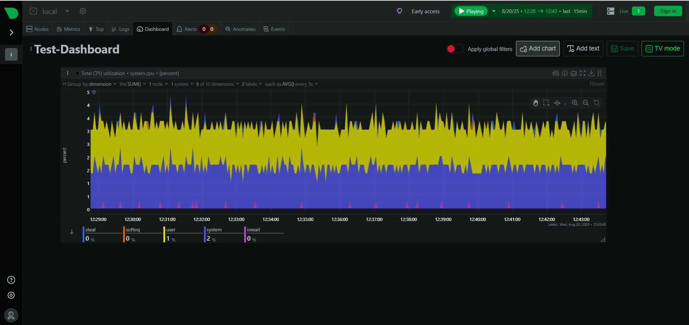
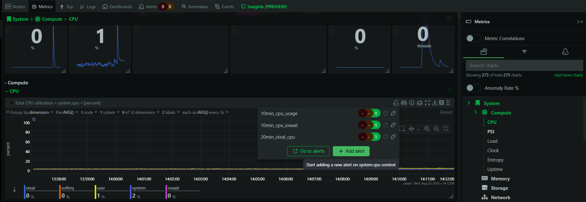
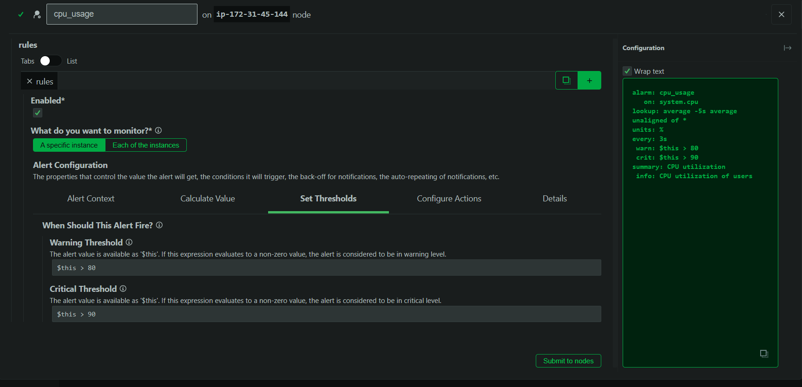
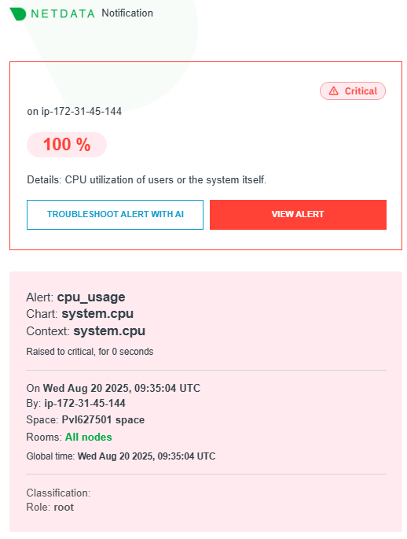

# Simple Monitoring
Set up a basic monitoring dashboard using Netdata.

### Steps I followed
- Created an ubuntu ec2 instance in aws.
- Installed Netdata agent in that instance using kickstart.sh file.
- If you want to install in the same way use the following doc.
  https://learn.netdata.cloud/docs/netdata-agent/installation/linux/#run-the-one-line-install-command
- After, installed netdata allowed 19999 port in security group of the instance to see the netdata agent console.
- Next, tried to see the console using public_ip_of_server:19999. It took me to the netdata agent console. Initially it asks to signin I chose the skip and use the dashboard anonymously option.
- After, chose the dashboard anonymously option it will shows the metrics of the instance.
- There, to check the CPU utilization metric. I installed stress in the instance to create CPU hike.
- Use the following command to create the CPU hike.
  
  ```bash
  stress --cpu 1 --timeout 300
  ```
  --timeout 300 is the CPU hike will happen only 300 seconds means 5 minutes.
- Then, I added system cpu utilization chart in the local-custom-dashboard from dashboard tab. And renamed the dashboard.
  


- Next, tried to create alarms in netdata but it requires signin in netdata cloud. I got the following error.
  
  ```bash
  Schema error
	You need to be authenticated via Netdata Cloud Single-Sign-On (SSO) to access this feature. Sign-in on this dashboard, or access your Netdata via https://app.netdata.cloud.

- After, Signed in in the netdata cloud using my gmail account.
- To create CPU Utilization alert selected the manage alerts in CPU utilization metric and click add alerts in the box.



- Then, changed the look back period to 5 seconds chose the % in units in calculate value tab. And set the warning thresholds to **$this > 80** critical thresholds to **$this > 90** in set thresholds tab.



- Next, saved the alarm by select the submit nodes.
- Then, tested the alarm using stress command in server. But, the alarm didn't send any message to mail.
- So, I referred some videos and documents. There, they created the alarm inside the server not in the netdata console.
- Therefore, I deleted the alarm which I created in netdata console.
- After, change the directory to /etc/netdata in the server and ran the following command.

  ```bash
  sudo ./edit-config health.d/cpu.conf
  ```

- Then, added the following lines in the file to create new alarm.

  ```bash
  alarm: cpu_usage
  on: system.cpu
  lookup: average -3s percentage foreach user,system
  units: %
  every: 10s
  warn: $this > 80
  crit: $this > 90
  info: CPU utilization of users or the system itself.
  ```

- Next, applied the changes by following command.

  ```bash
  sudo netdatacli reload-health
  ```

- After, I checked the netdata console the cpu_usage alarm created successfully.
- Furthermore, tested the alarm using stress command. And I got alert mail successfully.


